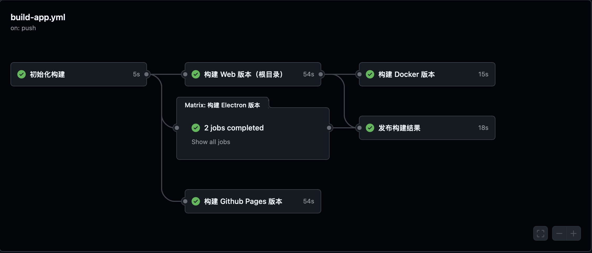

<p align="center">
  <a href="https://blog.stapxs.cn" target="blank">
    
  </a>
  <h2 align="center" style="font-weight: 600">Stapxs QQ Lite 2.0</h2>
 <p align="center">
  
 </p>
  <p align="center">
    一个兼容 OneBot 的非官方网页 QQ 客户端
    <br />
    <a href="https://stapxs.github.io/Stapxs-QQ-Lite-2.0/" target="blank"><strong>🌎 访问 DEMO</strong></a>&nbsp;&nbsp;|&nbsp;&nbsp;
    <a href="https://github.com/Stapxs/Stapxs-QQ-Lite-2.0/releases" target="blank"><strong>📦️ 下载程序</strong></a>&nbsp;&nbsp;|&nbsp;&nbsp;
    <a href="https://github.com/Stapxs/Stapxs-QQ-Lite-2.0/issues/new?assignees=Stapxs&labels=%3Abug%3A+%E9%94%99%E8%AF%AF&template=----.md&title=%5B%E9%94%99%E8%AF%AF%5D" target="blank"><strong>💬 反馈问题</strong></a>
    <br />
    <br />
    <strong>本网页应用仅供学习交流使用，请勿用于其他用途</strong><br>
    <strong>版权争议请提出 issue 协商</strong>
  </p>
</p>


## ✨ 特性支持

- ✅ 使用 Vue.js 全家桶开发，快乐前后端分离
- 🎨 自适应布局，竖版也能使用
- 🖥️ 支持 PWA（都有 Electron 了（小声））
- 🌚 Light/Dark Mode 自动切换
- 🍱 该有的都有（虽然比不过官方端）
  - 复杂消息显示、转发、回复、撤回
  - 群文件、群公告、群设置（一小部分）、精华消息
  - 图片、收藏表情、文件发送
- 📦️ 支持多种 bot，我就是要用！
- 🔥 水深火热但是更好看的 Electron 客户端
- 🥚 彩蛋！来更多的彩蛋！
- 🛠 更多特性开发中

## ♿️ 快速使用

### > 运行服务

Stapxs QQ Lite 需要一个 QQ Bot 后端提供服务，你可以参考 [📖 这个文档](https://github.com/Stapxs/Stapxs-QQ-Lite-2.0/wiki/%E5%BF%AB%E9%80%9F%E5%BC%80%E5%A7%8B) 布置它。

### > 访问网页

本仓库开启了 GitHub Pages, 所有向主分支提交的代码将会自动构建并发布。你可以直接访问 [🌎 这个页面](https://stapxs.github.io/Stapxs-QQ-Lite-2.0) 来使用已经构建并部署的页面。

### > 安装客户端

除了直接使用本仓库的构建页面，你也可以下载使用 electron 打包的功能**稍稍**更丰富的客户端版本，访问 [📦️ 这儿](https://github.com/Stapxs/Stapxs-QQ-Lite-2.0/releases) 查看版本发布列表。

当然你也可以使用包管理来安装它，使用包管理安装将会更便于更新 Stapxs QQ Lite 而不用每次都从 Github 上手动更新，访问 [💬 这儿](https://github.com/Stapxs/Stapxs-QQ-Lite-2.0/issues/99) 来查看目前支持的包管理。

### > 自行部署网页

Stapxs QQ Lite 在版本发布时构建了一份根目录下的 Web 文件，你可以在 [📦️ 这儿](https://github.com/Stapxs/Stapxs-QQ-Lite-2.0/releases) 找到它，它一般叫做```Stapxs.QQ.Lite-<版本>-web.zip```，将它解压放置到你的网页服务器中即可。

什么？不会部署网页服务器？Stapxs QQ Lite 网页版现在已经发布到了 [npm](https://www.npmjs.com/package/ssqq-web) 上！你可以使用 npx 工具快速启动它：

``` bash
npx ssqq-web hostname=127.0.0.1 port=8081
```

## 💬 提醒和问题

### > 关于不安全连接

- 当使用 https 页面连接 ws 服务（反之相同）的情况下，连接将会失败；这是由于其中某一者是不安全的。在这种情况下，你可以选择将 ws 提升为 wss 或者将 https 降级为 http（不安全）来解决问题，此处不提供解决方案。>> [Stapxs-QQ-Lite#32](https://github.com/Stapxs/Stapxs-QQ-Lite/issues/32)

### > 我能使用其他 QQ Http Bot 吗

- 如果它兼容 [OneBot 11 协议](<https://github.com/botuniverse/onebot-11>), 你可以尝试连接它, 但是由于消息体格式和接口扩展的差异，大部分情况下都不能完全正常使用。
  已经兼容的 Bot 都写在了文档里，可以去 [这里](https://github.com/Stapxs/Stapxs-QQ-Lite-2.0/wiki) 查看。

### > 使用 Bot 是否有风险

- 如果你使用的是 oicq-http, 可以查看此处了解 [使用风险](<https://github.com/takayama-lily/oicq/wiki/98.%E5%85%B3%E4%BA%8E%E8%B4%A6%E5%8F%B7%E5%86%BB%E7%BB%93%E5%92%8C%E9%A3%8E%E6%8E%A7>), 如果你尝试使用其他 QQ Bot (参见上一条问题), 请自行参考它的文档。

### > 我遇到了问题

- 如果有什么奇奇怪怪的问题, 欢迎发起 [issue](<https://github.com/Stapxs/Stapxs-QQ-Lite/issues>) 询问! 如果有什么 BUG 和优化建议也可以哦!

## 📦️ 构建应用

为了规范对其他仓库的引用，Stapxs QQ Lite 2.0 仓库含有一些子模块，这意味着你需要在克隆仓库的时候包含子模块：

``` bash
git clone https://github.com/Stapxs/Stapxs-QQ-Lite-2.0 --recursive
```

如果你已经克隆了仓库，也可以使用这个来补全子模块：

``` bash
git submodule update --init
```

在开始构建之前请安装依赖，请确保安装了 `yarn`：

``` bash
# 安装依赖
yarn

or

yarn install
```

### > 构建 Web 页面

Stapxs QQ Lite 2.0 是一个基于 Vue 的单页应用，这意味着如果你想自行部署到网页服务需要进行构建。当然你同样可以前往 [这儿](https://github.com/Stapxs/Stapxs-QQ-Lite-2.0/releases) 来下载预构建好的根目录文件包。

下面是构建该项目的命令，构建结果将最终输出在 `dist` 目录下：

``` bash
# 运行本地调试
yarn dev

# 代码检查和自动格式化
yarn lint

# 构建应用
yarn build
```

#### SSE 模式
Stapxs QQ Lite 2.0 支持 SSE 模式。在此模式下本应用将以 HTTP SSE + HTTP API 的方式连接到 QQ Bot 后端以提供更快速和轻量化的连接；甚至可以直接抛弃 SSE 通知推送，仅使用 HTTP API 进行通信。

SSE 模式不支持动态切换，你需要在构建前修改 `.env` 环境变量中 `VITE_APP_SSE` 开头的项来启用 SSE 模式。启用了 SSE 模式后页面将不能使用其他模式。

~~~ ini
VITE_APP_SSE_MODE=true
VITE_APP_SSE_SUPPORT=true
VITE_APP_SEE_EVENT_ADDRESS=api/_events
VITE_APP_SEE_HTTP_ADDRESS=api
~~~
SSE_MODE 指定了 SSE 模式的主要开关；

SSE_SUPPORT 指定了是否支持 SSE 模式。为 false 时将仅使用 HTTP API 进行通信，这将无法接收到 QQ Bot 的主动推送消息而导致部分功能缺失：
- 失去新的消息推送、通知推送
- 聊天面板新消息将不会自动更新，但依旧可以通过重新加载面板来获取新消息

剩余的两项指定了 SSE 模式的地址，你可以根据自己的需求来修改。

### > 构建 Electron 客户端

在 `2.3.0` 版本后，Stapxs QQ Lite 2.0 支持构建为 Electron 应用并补充部分平台特性的功能，你也可以自行构建。

下面是构建 Electron 应用的命令，构建结果将最终输出在 `dist_electron/out` 目录下：

``` bash
# electron 运行本地调试
yarn dev:electron

# electron 构建应用
yarn build:win
```

更多功能查看 [命令列表](#-命令列表)

### > 构建 Capacitor 应用
在 `3.0.0` 版本及以后，Stapxs QQ Lite 2.0 支持通过 Capacitor 构建为移动端应用并补充部分平台特性的功能，你也可以自行构建。

#### Android
你可以使用 `yarn open:android` 来打开 Android Studio。通过 Build -> Generate Signed Bundle or APK 来构建 APK 文件。

你也可以直接使用 `yarn build:android` 来构建 APK 文件。请检查修改 `capacitor.config.ts` 文件中的 `android.buildOptions` 中的 keyStore 配置。

构建结果将最终输出在 `src/mobile/android/app/build/outputs/apk/release` 目录下。

#### iOS
你可以使用 `yarn open:ios` 来打开 Xcode。通过 Product -> Archive 来构建 IPA 文件。

你也可以直接使用 `yarn build:ios` 来构建 IPA 文件。此构建方式将执行 `scripts/build-export-ipa.sh` 脚本，构建将使用钥匙串中的默认开发者证书，请确保你的开发者证书已经配置。

XCode 的构建结果将最终输出在 `src/mobile/ios/build` 目录下，脚本构建结果将输出在 `dist_capacitor` 目录下。

### > 命令列表

**命令格式为`yarn <命令>`，其中`<命令>`为列表中的一个：**

| 命令           | 描述                |
| -------------- | ------------------ |
| install        | 安装依赖            |
| lint           | 代码检查和自动格式化  |
| update:icon    | 更新移动端应用图标集  |
| update:version | 更新移动端应用版本号  |
| dev            | 网页调试            |
| dev:electron   | Electron 调试      |
| dev:ios        | iOS 调试           |
| dev:android    | 安卓调试            |
| open:ios       | 在 XCode 中打开项目  |
| open:android   | 在 Android Studio 中打开项目  |
| build          | 网页构建            |
| build:win      | 构建 Windows 应用   |
| build:mac      | 构建 macOS 应用    |
| build:linux    | 构建 Liunx 应用     |
| build:ios      | 构建 iOS 应用       |
| build:android  | 构建 Andorid 应用   |

### > Github Actions

*为什么会有人对自动构建感兴趣，总之自动构建脚本我写了好久。感兴趣就自己去看好了（无端）。*



## 🎉 鸣谢

感谢这些小伙伴们在开发和文本中提供的支持 ——

<a href="https://github.com/Logic-Accepted"></a>
<a href="https://github.com/doodlehuang"></a>
