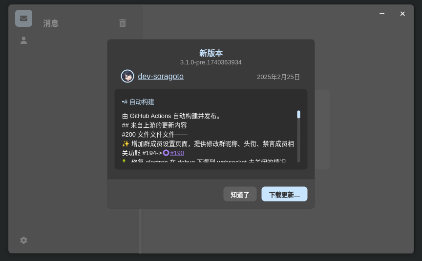

# Stapxs-QQ-Lite-2.0-pre-release

## 警告

既然是 pre-release 那发生什么异常都是有可能的，谨慎使用

## web端使用

[https://dev-soragoto.github.io/Stapxs-QQ-Lite-2.0-pre-release/](https://dev-soragoto.github.io/Stapxs-QQ-Lite-2.0-pre-release/)

## 这是做什么的

为 [Stapxs-QQ-Lite](https://github.com/Stapxs/Stapxs-QQ-Lite-2.0) 提供一个非官方的 pre-release

## ci的步骤以及对源仓库的更改

1. 自动同步上游最新分支。
2. 删除多余的release,只保留最近10个。
3. 在electron打包上加上Arch-linux原生包。
4. 更改上游最新分支的版本号，如果是 pre-release 添加最后一次更新的时间戳。
5. 把更新检测指向本仓库。
6. 打包，在本仓库发布 release 。

## 因为ci修改过更新检测的仓库，所以新的更新推送会以这种方式呈现

